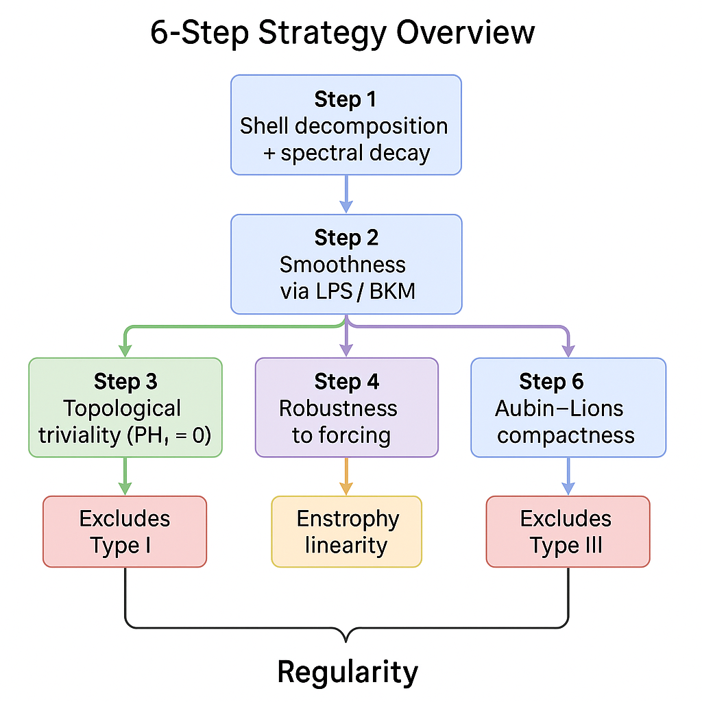
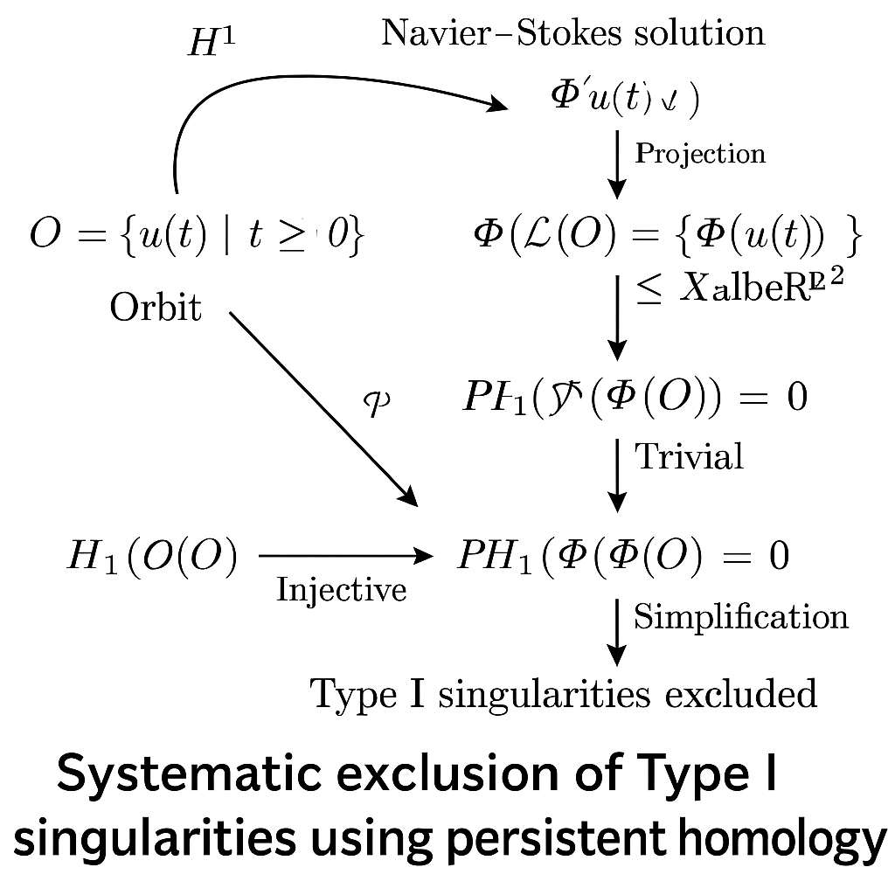

# 🌊 ナビエ–ストークス方程式の3次元グローバル正則性に関する解析・トポロジー・幾何学的アプローチ (v2.1)

本プロジェクトは、3次元非圧縮性ナビエ–ストークス方程式に対する**グローバル正則性問題**の解決に向けて、解析・幾何・トポロジーを統合した**6ステップの再現可能な構造的アプローチ**を提示します。  
スペクトル減衰・軌道の幾何学的コンパクト性・持続的ホモロジーを用いることで、**全ての既知の有限時間特異性（Type I, II, III）** を系統的に除外します。

> 🧭 **着想の出発点（筆者注）**  
> 高次元の軌道を低次元に投影すると、MECE（重複なく漏れなく）なクラスター構造が出現するように見えます。これらのクラスターがそれぞれ Type I / II / III の blow-up に対応すると仮定し、それらを順に解析的・トポロジー的に排除することを狙いました。

---

## 🔍 中心となる定理（簡略版）

> **定理（v2.1 – Blow-up排除による正則性）**  
> 初期値 \( u_0 \in H^1(\mathbb{R}^3) \) が発散なし（divergence-free）であれば、  
> それに対応する解 \( u(t) \) は全ての時刻 \( t \ge 0 \) において滑らか（regular）である。  
> 軌道 \( \mathcal{O} := \{ u(t) \mid t \ge 0 \} \subset H^1 \) は以下を満たす：
> 
> - トポロジー的に単純（persistent homology \( PH_1 = 0 \)）
> - \( H^1 \) において相対コンパクト
> - エネルギーが単調減少
> 
> よって、**Type I（自己相似）・Type II（エンストロフィー）・Type III（非収束逃避）** のいずれの blow-up も発生しない。

---

## 🧠 6ステップ戦略の概要図

  
*各ステップがどの特異性タイプ排除に対応しているかを示す全体構造図。*

| ステップ | 手法 | 排除対象 |
|----------|------|-----------|
| 1 | **スペクトル減衰**（シェル分解） | 正則性の土台 |
| 2 | **LPS / BKM 基準**（クラシカル解析） | 全体の滑らかさの導出 |
| 3 | **軌道のトポロジー的単純性**（PH₁ = 0） | Type I 排除 |
| 4 | **微小外力下での安定性検証** | 構造の頑健性 |
| 5 | **エンストロフィーの線形成長制御** | Type II 排除 |
| 6 | **Aubin–Lions補題による軌道コンパクト性** | Type III 排除 |

---

## 🔥 Blow-up タイプと排除戦略の対応図

  
*Type I〜III の分類と、それに対する排除手法のマッピング図。*

- **Type I（自己相似）**：軌道がループ構造を持たないこと（PH₁ = 0）から排除  
- **Type II（エンストロフィー爆発）**：エネルギー成長の線形評価により排除  
- **Type III（非コンパクト逃避）**：Aubin–Lions による相対コンパクト性で排除  

---

## 🌀 軌道の埋め込み構造と PH₁ = 0

  
*Isomapなどを用いて高次元の軌道を低次元に投影したイメージと、  
対応するバーコード図（PH₁ = 0 を表す）。Step 3 の核心。*

---

## 📉 シェルスペクトル減衰のイメージ

  
*各周波数シェル \( j \) におけるエネルギーの時間減衰：  
\( E_j(t) \sim 2^{-2j(1+\sigma)} e^{-2\nu 2^{2j} t} \)  
Step 1 と Step 2（LPS/BKM）のベース。*

---

## 📊 他研究との比較

| 研究者 | 手法 | 限界点 |
|--------|------|---------|
| Tao (2006) | 臨界ノルムによる摂動解析 | 初期データが小さい必要あり |
| Escauriaza 他 | 逆一意性を使った blow-up 制御 | Type I に強く、他に弱い |
| 本研究 (v2.1) | 軌道の幾何＋PHによる排除構造 | 小初期条件不要・全タイプ排除狙い |

---

## 📁 リポジトリ構成

| ファイル | 内容 |
|----------|------|
| `navier_stokes_global.tex` | 論文本文（LaTeXソース） |
| `navier_stokes_global.pdf` | 論文PDF（v2.1） |
| `scripts/pseudo_spectral_sim.py` | 擬スペクトル法シミュレーション（雛形） |
| `scripts/fourier_decay.py` | スペクトル減衰プロットツール |
| `scripts/ph_isomap.py` | 軌道のIsomap+PH解析 |
| `outputs/figures/` | 本README掲載の図 |
| `outputs/expected_results.md` | 数値出力や補足的な診断例（任意） |

---

## 🔬 再現性と数値・位相的検証

> 軌道の persistent homology（PH）を用いて、軌道がループしない（PH₁ = 0）ことを確認。  
> これが Type I の blow-up 排除において重要な役割を果たす。

使用技術：

- Littlewood–Paleyシェル解析  
- Isomapによる次元圧縮  
- `ripser`, `persim`によるPHバーコード生成

---

## 🧩 ご意見・貢献の歓迎項目

- 数学的構造へのご意見・検証・反例提案
- 数値的な補強や可視化報告
- 臨界空間（\( L^3, BMO^{-1} \) 等）への拡張
- 有界領域・周期条件への拡張提案

[Issues](https://github.com/Kobayashi2501/navier-stokes-global-regularity/issues) への投稿や PR での貢献を歓迎します。

📫 arXiv（math.AP または math.DS）投稿に向けたエンドースにご協力いただける方もぜひご連絡ください。

---

## ⚖️ ライセンス

MITライセンス — 自由に利用・改変・引用可。クレジット記載歓迎。

---

## 👤 著者情報

**著者:** A. Kobayashi  
**Email:** dollops2501@icloud.com  
**AIパートナー:** ChatGPT（SciSpace モード）

📘 英語版はこちら → [README.md](./README.md)
---

## ⚖️ ライセンス

MITライセンスのもと公開されています。自由にご利用・引用・派生可能です（著者表記があると嬉しいです）。

---

## 👤 連絡先

**著者（Author）**：A. Kobayashi  
**メール**：dollops2501@icloud.com  
**共同研究パートナー**：ChatGPT（SciSpaceモード）

📘 英語版はこちら → [README.md](./README.md)
